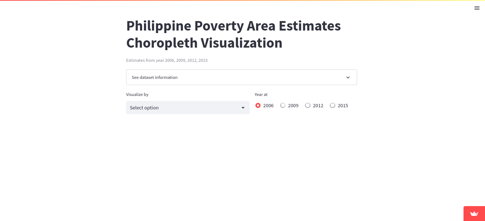
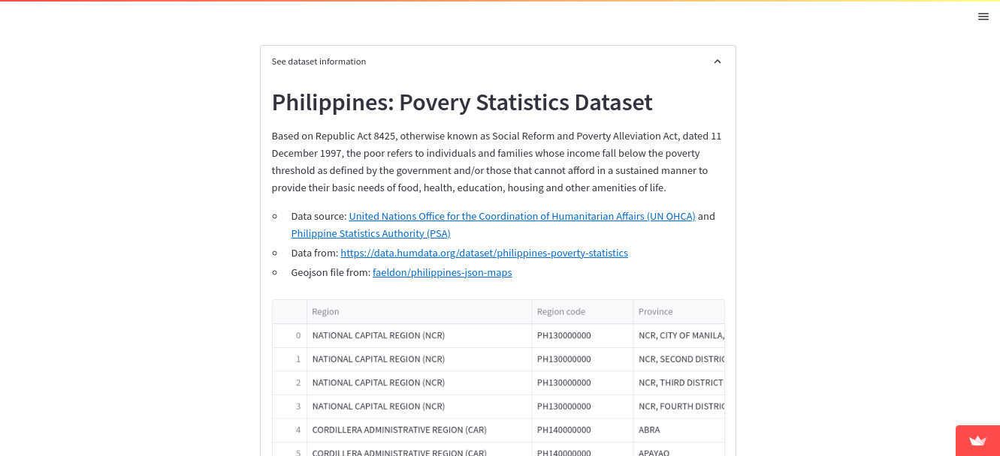
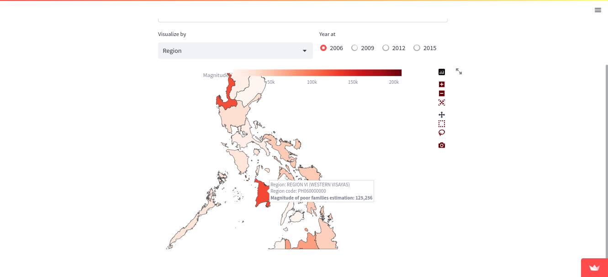
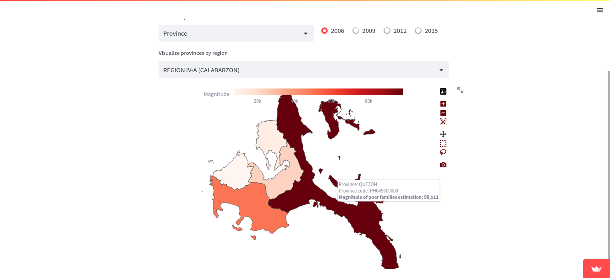

# Philippine Poverty Area Estimates
A web application providing a visual representation using a choropleth map of the estimated magnitude of poor families in the Philippines from the years 2006, 2009, 2012, and 2015. 
* See live: https://ph-poverty-area-estimates.streamlit.app
* View process: https://hyoaru.github.io/philippine-poverty-area-estimates-choropleth/

## Philippines: Povery Statistics Dataset
Based on Republic Act 8425, otherwise known as Social Reform and Poverty Alleviation Act, dated 11 December 1997, the poor refers to individuals and families whose income fall below the poverty threshold as defined by the government and/or those that cannot afford in a sustained manner to provide their basic needs of food, health, education, housing and other amenities of life.
* Data source: [United Nations Office for the Coordination of Humanitarian Affairs (UN OHCA)](https://www.unocha.org/philippines) and [Philippine Statistics Authority (PSA)](https://psa.gov.ph)
* Data from: https://data.humdata.org/dataset/philippines-poverty-statistics
* Geojson file from: [faeldon/philippines-json-maps](https://github.com/faeldon/philippines-json-maps)

## Interface preview

